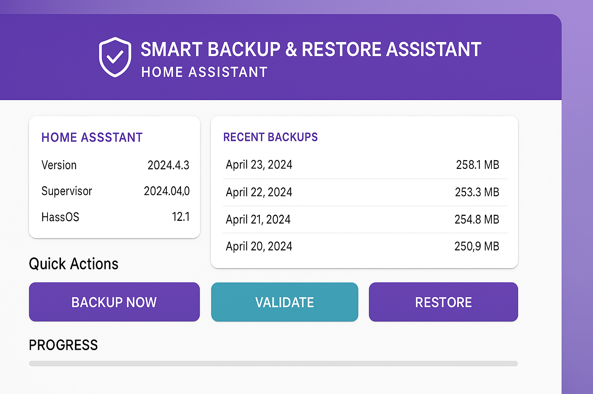

# Smart Backup & Restore Assistant - Add-on Repository

[![GitHub Release][releases-shield]][releases]
[![License][license-shield]](LICENSE)

A Home Assistant add-on repository containing the Smart Backup & Restore Assistant.



## About

This repository contains the **Smart Backup & Restore Assistant** add-on for Home Assistant. This add-on enhances Home Assistant's built-in backup functionality by adding intelligent validation and compatibility checking.

### Key Features

- 🔍 **Smart Validation** - Analyzes backups before restoration
- ⚠️ **Breaking Changes Detection** - Identifies compatibility issues automatically
- 📊 **Risk Assessment** - Clear low/medium/high risk indicators
- 🎨 **Beautiful Material Design UI** - Modern, responsive interface
- 📅 **Automatic Backups** - Schedule daily, weekly, or monthly backups
- 🔔 **Notifications** - Get alerts when backups complete or fail

## Installation

### Add Repository to Home Assistant

1. Navigate to **Settings** → **Add-ons** → **Add-on Store** in your Home Assistant
2. Click the **⋮** menu in the top right corner
3. Select **Repositories**
4. Add this repository URL:
   ```
   https://github.com/YOUR_USERNAME/smart-backup-assistant
   ```
5. Click **Add**
6. Click **Close**

### Install the Add-on

1. Refresh the Add-on Store page
2. Find **Smart Backup & Restore Assistant** in the list
3. Click on it
4. Click **Install**
5. Wait for installation to complete
6. Toggle **Start on boot** (recommended)
7. Click **Start**
8. Click **Open Web UI**

## Add-ons in this Repository

### Smart Backup & Restore Assistant

A powerful add-on that validates backups and checks for compatibility issues before restoration.

**[Full Documentation →](smart-backup-assistant/README.md)**

**Features:**
- Backup validation before restore
- Version compatibility checking
- Breaking changes detection
- Automatic backup scheduling
- Beautiful Material Design interface
- REST API for automation
- Notification support
- Password-protected backups

## Support

- 📖 [Full Documentation](smart-backup-assistant/README.md)
- 💬 [GitHub Discussions](https://github.com/YOUR_USERNAME/smart-backup-assistant/discussions)
- 🐛 [Issue Tracker](https://github.com/YOUR_USERNAME/smart-backup-assistant/issues)
- 💭 [Home Assistant Community](https://community.home-assistant.io/)

## Contributing

Contributions are welcome! Please read the [Contributing Guidelines](smart-backup-assistant/CONTRIBUTING.md).

## License

This project is licensed under the MIT License - see the [LICENSE](smart-backup-assistant/LICENSE) file for details.

## Changelog

See [CHANGELOG.md](smart-backup-assistant/CHANGELOG.md) for version history.

---

**If you like this add-on, please ⭐ star this repository!**

[releases-shield]: https://img.shields.io/github/release/YOUR_USERNAME/smart-backup-assistant.svg
[releases]: https://github.com/YOUR_USERNAME/smart-backup-assistant/releases
[license-shield]: https://img.shields.io/github/license/YOUR_USERNAME/smart-backup-assistant.svg

