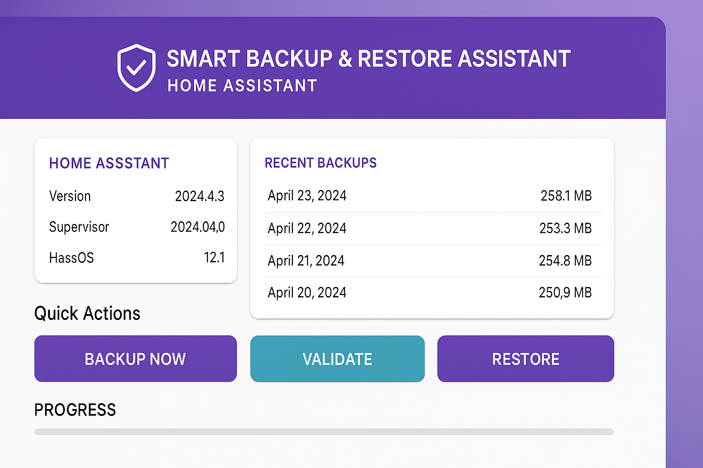

# Smart Backup & Restore Assistant

[![GitHub Release][releases-shield]][releases]
[![License][license-shield]](LICENSE)
[![Project Maintenance][maintenance-shield]][user_profile]

A powerful Home Assistant add-on that validates backups and checks for compatibility issues before restoration.



## About

The **Smart Backup & Restore Assistant** enhances Home Assistant's built-in backup functionality by adding intelligent validation and compatibility checking. Never worry about breaking your system during a restore again!

### Key Features

- 🔍 **Smart Validation** - Analyzes backups before restoration
- ⚠️ **Breaking Changes Detection** - Identifies compatibility issues automatically
- 📊 **Risk Assessment** - Clear low/medium/high risk indicators
- 🎨 **Beautiful Material Design UI** - Modern, responsive interface
- 📅 **Automatic Backups** - Schedule daily, weekly, or monthly backups
- 🔔 **Notifications** - Get alerts when backups complete or fail
- 💾 **Storage Management** - Automatic cleanup of old backups
- 🔐 **Password Protection** - Optional encryption for backups

## Why Use This Add-on?

Home Assistant's built-in backup system is great, but it doesn't warn you about potential issues before restoring. This add-on solves that problem by:

1. **Checking version compatibility** between backup and current system
2. **Detecting breaking changes** that affect your integrations
3. **Providing detailed reports** with actionable recommendations
4. **Preventing system breakage** from incompatible restores

## Screenshots

### Dashboard


### Validation Report


### Configuration


## Installation

### Step 1: Add Repository

1. Navigate to **Settings** → **Add-ons** → **Add-on Store**
2. Click the **⋮** menu (top right corner)
3. Select **Repositories**
4. Add this URL:
   ```
   https://github.com/kasim141-a/smart-backup-assistant
   ```
5. Click **Add** then **Close**

### Step 2: Install Add-on

1. Refresh the Add-on Store page (F5 or pull down)
2. Find **Smart Backup & Restore Assistant** in the list
3. Click on the add-on
4. Click **Install**
5. Wait for installation to complete (2-5 minutes)

### Step 3: Start Add-on

1. Toggle **Start on boot** to ON (recommended)
2. Click **Start**
3. Wait for the add-on to start (30-60 seconds)
4. Click **Open Web UI**

That's it! The add-on is now running.

## Configuration

### Basic Configuration

```yaml
auto_backup_enabled: true
backup_schedule: daily
backup_time: "03:00"
backup_retention_days: 7
validate_before_restore: true
notifications_enabled: true
```

### All Configuration Options

| Option | Type | Default | Description |
|--------|------|---------|-------------|
| `auto_backup_enabled` | bool | `true` | Enable automatic backups |
| `backup_schedule` | list | `daily` | Schedule: hourly, daily, weekly, monthly |
| `backup_time` | string | `03:00` | Time to run backups (24-hour format) |
| `backup_retention_days` | int | `7` | Days to keep backups (1-365) |
| `validate_before_restore` | bool | `true` | Validate backups before restoring |
| `allow_version_mismatch` | bool | `false` | Allow restoring from different versions |
| `check_breaking_changes` | bool | `true` | Check for breaking changes |
| `notifications_enabled` | bool | `true` | Enable notifications |
| `notify_on_backup_complete` | bool | `true` | Notify when backup completes |
| `notify_on_backup_failed` | bool | `true` | Notify when backup fails |
| `notify_on_validation_warning` | bool | `true` | Notify on validation warnings |
| `notification_service` | string | `notify.notify` | Notification service to use |
| `compression_enabled` | bool | `true` | Compress backups to save space |
| `password_protected` | bool | `false` | Encrypt backups with password |
| `backup_password` | password | - | Password for encrypted backups |
| `max_concurrent_backups` | int | `1` | Maximum concurrent backup operations |
| `backup_timeout_minutes` | int | `60` | Backup timeout in minutes |
| `theme` | list | `auto` | UI theme: auto, light, dark |
| `show_advanced_options` | bool | `false` | Show advanced options in UI |
| `debug_mode` | bool | `false` | Enable debug logging |
| `log_level` | list | `info` | Log level: debug, info, warning, error |

## Usage

### Creating a Backup

1. Open the add-on Web UI
2. Click "Backup Now" in Quick Actions
3. Confirm the action
4. Wait for completion (2-5 minutes)

### Validating a Backup

1. Open the add-on Web UI
2. Select a backup from the list
3. Click "Validate"
4. Review the validation report:
   - ✅ **Compatible** - Safe to restore
   - ⚠️ **Compatible with Warnings** - Proceed with caution
   - ❌ **Incompatible** - Not recommended

### Restoring a Backup

**⚠️ Important: Always validate before restoring!**

1. Validate the backup first (see above)
2. Click "Restore" in Quick Actions
3. Read the warning carefully
4. Click "Confirm"
5. Wait for restore and system restart (10-15 minutes)

### Automatic Backups

Configure in the add-on Configuration tab:

1. Enable "Automatic Backups"
2. Set schedule (daily recommended)
3. Set time (3:00 AM recommended)
4. Set retention period (7 days recommended)
5. Save configuration

Backups will run automatically on schedule!

## API Endpoints

The add-on provides a REST API for automation:

### System Status
```http
GET /api/status
```

### List Backups
```http
GET /api/backups
```

### Create Backup
```http
POST /api/backups/create
Content-Type: application/json

{
  "name": "My Backup"
}
```

### Validate Backup
```http
POST /api/backups/{backup_id}/validate
```

### Restore Backup
```http
POST /api/backups/{backup_id}/restore
```

### Get Configuration
```http
GET /api/config
```

### Update Configuration
```http
POST /api/config
Content-Type: application/json

{
  "auto_backup_enabled": true,
  "backup_schedule": "daily"
}
```

## Automation Examples

### Create Backup Before Update

```yaml
automation:
  - alias: "Backup Before Update"
    trigger:
      - platform: state
        entity_id: update.home_assistant_core_update
        to: "on"
    action:
      - service: hassio.addon_stdin
        data:
          addon: smart_backup_assistant
          input:
            service: create_backup
            name: "Pre-update backup"
```

### Notify on Backup Failure

```yaml
automation:
  - alias: "Backup Failed Alert"
    trigger:
      - platform: event
        event_type: backup_failed
    action:
      - service: notify.mobile_app
        data:
          title: "Backup Failed!"
          message: "Check the Smart Backup Assistant logs"
```

## Troubleshooting

### Add-on Won't Start

**Check logs:**
```bash
Settings → Add-ons → Smart Backup & Restore Assistant → Log
```

**Common causes:**
- Insufficient disk space (need at least 1 GB free)
- Port conflict (default: 8099)
- Missing dependencies

**Solution:**
1. Free up disk space
2. Restart the add-on
3. Check for error messages in logs

### Backup Takes Too Long

**Causes:**
- Large configuration
- Slow storage
- System under heavy load

**Solutions:**
- Schedule backups during low usage times
- Enable compression
- Increase timeout in configuration

### Validation Fails

**Causes:**
- Corrupted backup file
- Incompatible version
- Missing metadata

**Solutions:**
- Try a different backup
- Check backup file integrity
- Create a new backup

### Restore Fails

**Causes:**
- Incompatible version
- Corrupted backup
- Insufficient space

**Solutions:**
- Validate backup first
- Check available disk space
- Use a more recent backup
- Check logs for specific errors

## Support

### Documentation

- 📖 [User Tutorial](docs/USER_TUTORIAL.md) - Complete beginner's guide
- 🚀 [Quick Start Guide](docs/QUICK_START_GUIDE.md) - Get started in 5 minutes
- 💻 [Developer Documentation](docs/DEVELOPER.md) - Technical details
- ⚙️ [Configuration Guide](docs/CONFIGURATION.md) - All options explained

### Community

- 💬 [Home Assistant Community Forum](https://community.home-assistant.io/)
- 💭 [GitHub Discussions](https://github.com/kasim141-a/smart-backup-assistant/discussions)
- 🐛 [Issue Tracker](https://github.com/kasim141-a/smart-backup-assistant/issues)

### Contributing

Contributions are welcome! Please read [CONTRIBUTING.md](CONTRIBUTING.md) for details.

## Changelog

See [CHANGELOG.md](CHANGELOG.md) for version history.

## License

This project is licensed under the MIT License - see the [LICENSE](LICENSE) file for details.

## Credits

- Built with [Material Design 3](https://m3.material.io/)
- Uses [Home Assistant Supervisor API](https://developers.home-assistant.io/docs/api/supervisor/)
- Inspired by the Home Assistant community

## Acknowledgments

Special thanks to:
- The Home Assistant development team
- The Home Assistant community for feedback and support
- All contributors and users who provide feedback

---

**If you like this add-on, please ⭐ star this repository!**

[releases-shield]: https://img.shields.io/github/release/kasim141-a/smart-backup-assistant.svg
[releases]: https://github.com/kasim141-a/smart-backup-assistant/releases
[license-shield]: https://img.shields.io/github/license/kasim141-a/smart-backup-assistant.svg
[maintenance-shield]: https://img.shields.io/maintenance/yes/2025.svg
[user_profile]: https://github.com/kasim141-a

